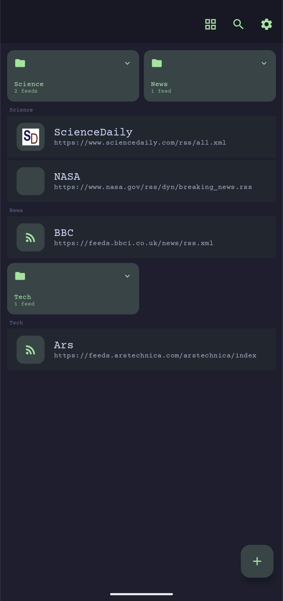
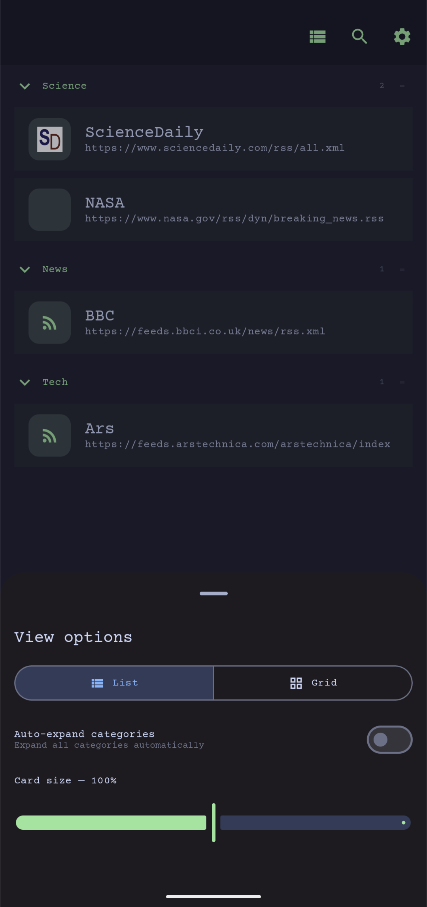
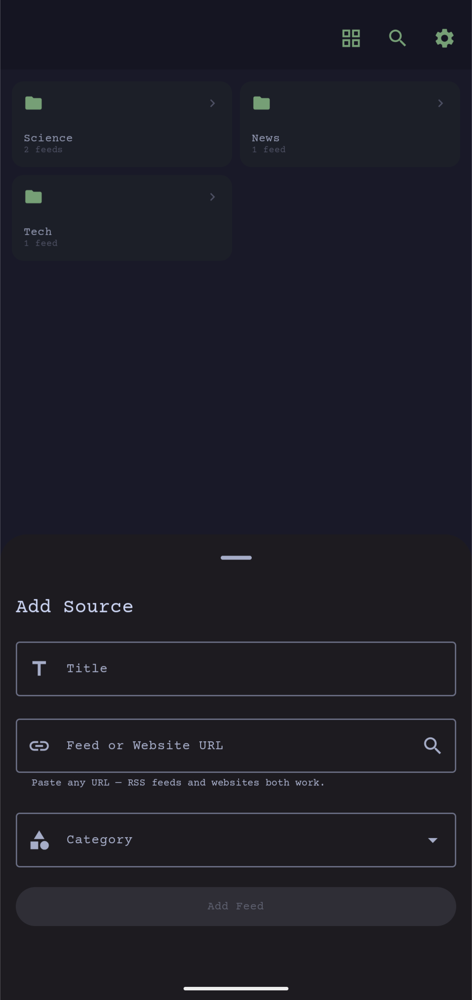
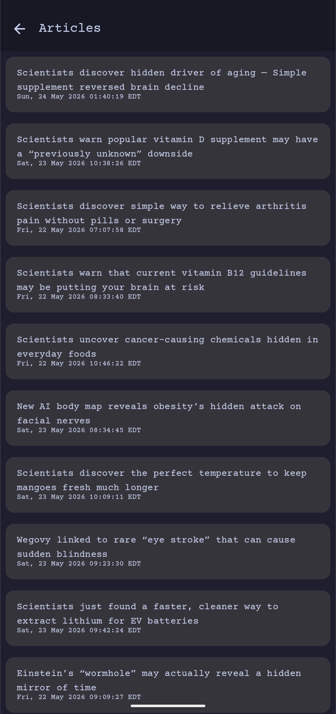
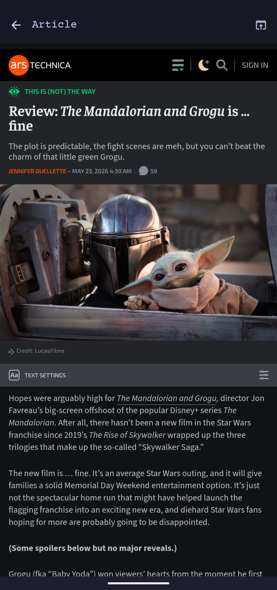
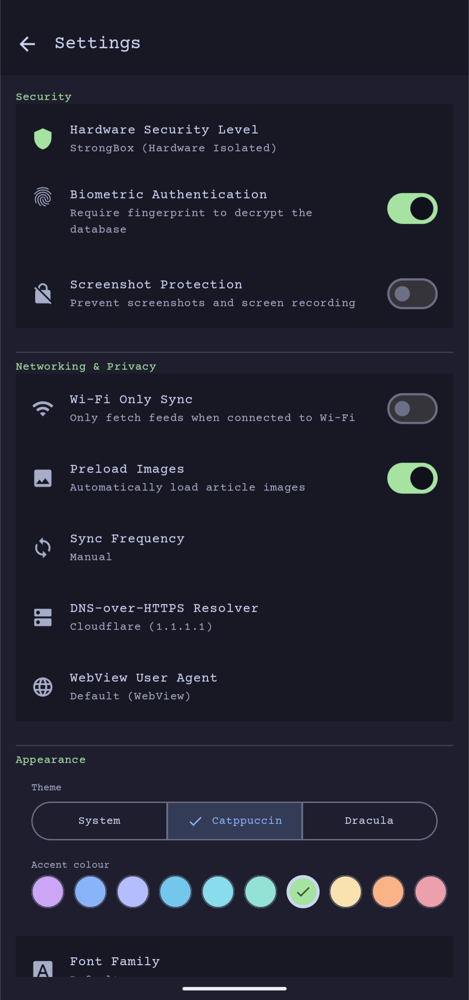
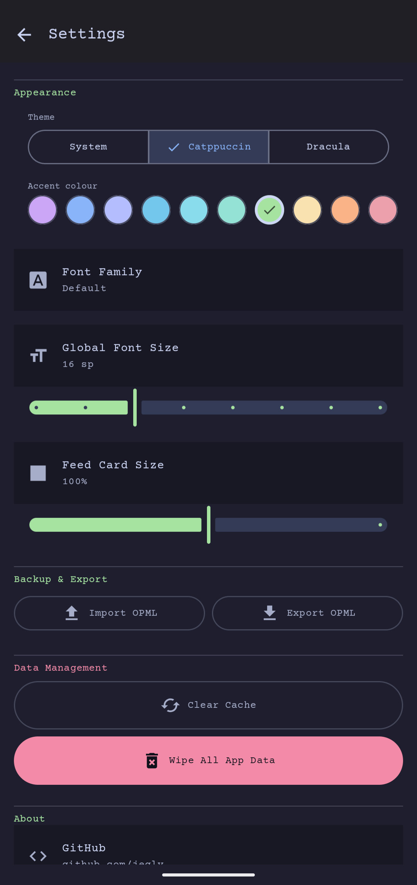
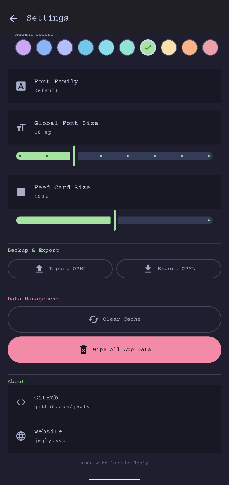

<p align="center">
    
  </p>


**A private, security-hardened RSS reader for Android with a built-in sandboxed browser**

  [](https://kotlinlang.org)
  [](https://developer.android.com)
  [](https://github.com/jegly/rss/releases)
  [](LICENSE) [](https://developer.android.com/jetpack/compose)

  [](https://github.com/jegly/rss/releases/latest)


If this project helped you, please ⭐️ star it. **Also try [OfflineLLM](https://github.com/jegly/OfflineLLM)** and **[Box](https://github.com/jegly/Box)** — on-device AI apps built on the same privacy-first philosophy.

---

**📱 Screenshots**

<table>
  <tr>
    <td></td>
    <td></td>
    <td></td>
  </tr>
  <tr>
    <td></td>
    <td></td>
    <td></td>
  </tr>
  <tr>
    <td></td>
    <td></td>
    <td></td>
  </tr>
</table>

---

## Features

- **Feed Categories** — organise feeds into folders; grid or list view with adjustable card size
- **Feed Discovery** — paste any URL; RSS feeds and plain websites both work
- **Hardened WebView** — built-in sandboxed browser: 30+ tracker and ad domains blocked at the network level, SSL errors hard-cancelled, popups blocked, camera / microphone / location denied, file access disabled, mixed content forbidden, Google Safe Browsing enabled
- **DNS-over-HTTPS** — choose Cloudflare (1.1.1.1), Quad9 (9.9.9.9) or Google (8.8.8.8); no plaintext DNS leaks
- **Encrypted Database** — SQLCipher AES-256 with a random passphrase gated behind auth; never touches disk unencrypted
- **Biometric Lock** — crypto-bound: the database passphrase is wrapped under an Android Keystore key that requires fingerprint; no software path to the data
- **StrongBox / TEE** — hardware-isolated AES-256-GCM keys via Google Tink; StrongBox used automatically on supported devices
- **HTTPS-only** — cleartext globally forbidden at OS level (`network-security-config`) and upgraded at OkHttp level as a second line of defence
- **Tracking param stripping** — UTM, `fbclid`, `gclid` and other tracking parameters removed from every opened link
- **SSRF Protection** — feed discovery rejects loopback, LAN, link-local, CGNAT and cloud metadata addresses
- **Response size cap** — feeds capped at 5 MB; prevents OOM and slowloris-style attacks against the parser
- **Screenshot Protection** — toggleable `FLAG_SECURE` prevents screen capture and app-switcher thumbnails
- **Themes** — System / Catppuccin Mocha (13 accent colours) / Dracula (7 accent colours)
- **OPML** — import and export your full feed list
- **Wi-Fi Only Sync** — never fetch feeds on mobile data

## Security

| Layer | Detail |
|-------|--------|
| Database | SQLCipher AES-256; passphrase gated on launch; `allowBackup=false` |
| Keys | AES-256-GCM via Google Tink; StrongBox hardware isolation on supported devices, TEE fallback |
| Biometric | `BIOMETRIC_STRONG` crypto-bound; passphrase wrapped under `setUserAuthenticationRequired` Keystore key; invalidated on biometric re-enrolment |
| Network | TLS 1.2 / 1.3 only (`MODERN_TLS`); cleartext forbidden at OS + OkHttp; response capped at 5 MB; DoH (Cloudflare / Quad9 / Google) |
| WebView | 30+ tracker / ad domains blocked; SSL errors cancelled; HTTP auth blocked; popups blocked; camera / mic / location denied; `allowFileAccess=false`; mixed content forbidden |
| App hardening | `taskAffinity=""`; `singleInstance`; APK signature verification; screenshot protection toggle |

## Install

1. Download the APK from [Releases](https://github.com/jegly/rss/releases/latest)
2. **Settings → Apps → Install unknown apps** → allow your file manager
3. Open the APK and tap Install

Requires Android 15+.

## Build from Source

```
git clone https://github.com/jegly/rss.git
cd rss
./gradlew assembleRelease
```

**Prerequisites:** JDK 17, Android SDK (compileSdk 37)

## License

Apache License 2.0

---

**[www.jegly.xyz](https://www.jegly.xyz)**

[](https://www.buymeacoffee.com/jegly)

